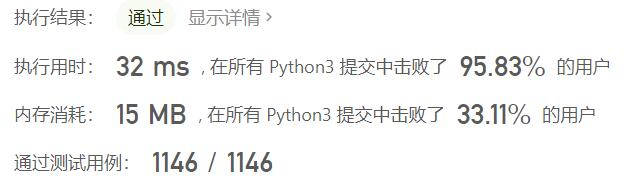
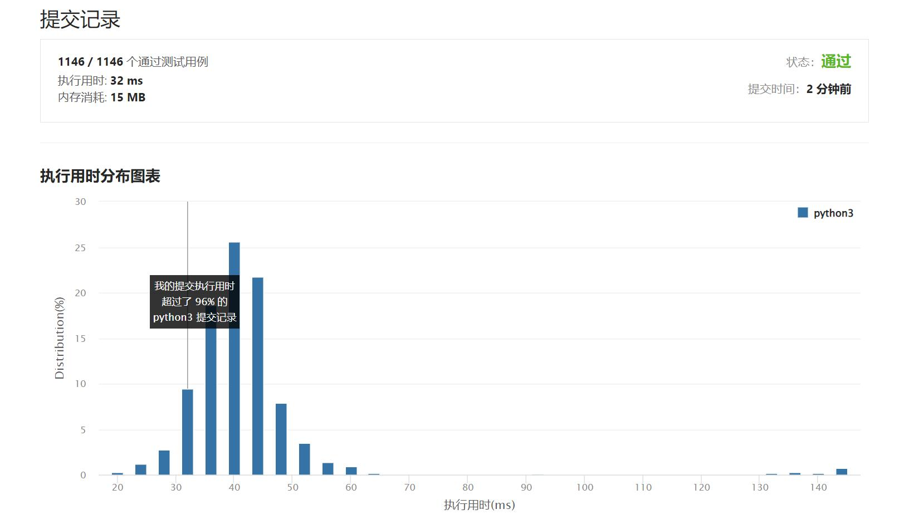

# 面试题01.05-一次编辑

Author：_Mumu

创建日期：2022/05/13

通过日期：2022/05/13

*****

踩过的坑：

1. 轻松愉快
1. 这也能是中等吗

已解决：338/2634

*****

难度：中等

问题描述：

字符串有三种编辑操作:插入一个字符、删除一个字符或者替换一个字符。 给定两个字符串，编写一个函数判定它们是否只需要一次(或者零次)编辑。

 

示例 1:

输入: 
first = "pale"
second = "ple"
输出: True

示例 2:

输入: 
first = "pales"
second = "pal"
输出: False

来源：力扣（LeetCode）
链接：https://leetcode.cn/problems/one-away-lcci