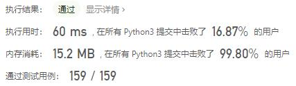
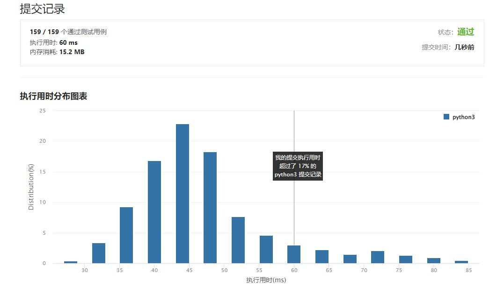

# 面试题01.08-零矩阵

Author：_Mumu

创建日期：2022/09/30

通过日期：2022/09/30

*****

踩过的坑：

1. 轻松愉快

已解决：476/2793

*****

难度：中等

问题描述：

编写一种算法，若M × N矩阵中某个元素为0，则将其所在的行与列清零。

 

示例 1：

输入：
[
  [1,1,1],
  [1,0,1],
  [1,1,1]
]
输出：
[
  [1,0,1],
  [0,0,0],
  [1,0,1]
]
示例 2：

输入：
[
  [0,1,2,0],
  [3,4,5,2],
  [1,3,1,5]
]
输出：
[
  [0,0,0,0],
  [0,4,5,0],
  [0,3,1,0]
]

来源：力扣（LeetCode）
链接：https://leetcode.cn/problems/zero-matrix-lcci