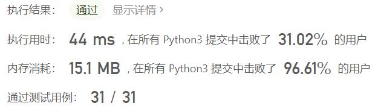
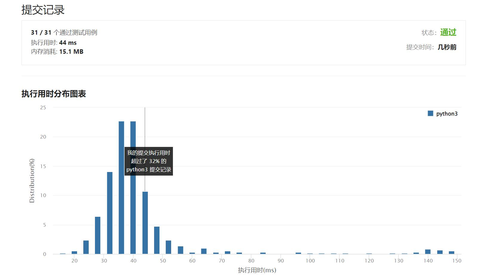

# 面试题01.09-字符串轮转

Author：_Mumu

创建日期：2022/09/29

通过日期：2022/09/29

*****

踩过的坑：

1. 轻松愉快

已解决：475/2793

*****

难度：简单

问题描述：

字符串轮转。给定两个字符串s1和s2，请编写代码检查s2是否为s1旋转而成（比如，waterbottle是erbottlewat旋转后的字符串）。

示例1:

 输入：s1 = "waterbottle", s2 = "erbottlewat"
 输出：True
示例2:

 输入：s1 = "aa", s2 = "aba"
 输出：False
提示：

字符串长度在[0, 100000]范围内。
说明:

你能只调用一次检查子串的方法吗？

来源：力扣（LeetCode）
链接：https://leetcode.cn/problems/string-rotation-lcci