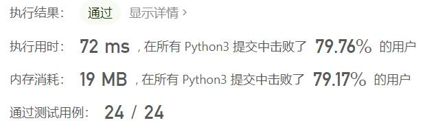
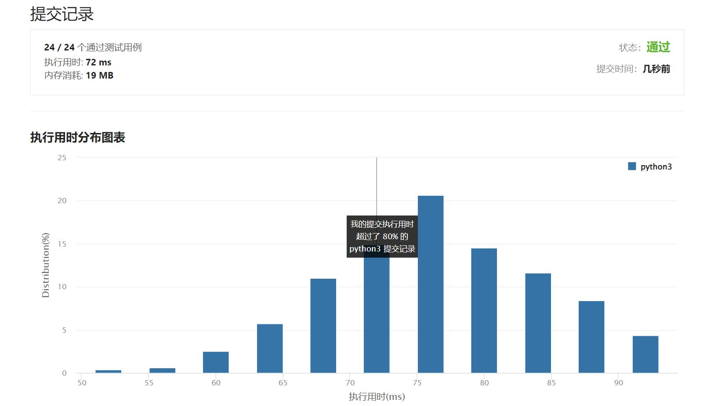

# 面试题04.06-后继者

Author：_Mumu

创建日期：2022/05/16

通过日期：2022/05/16

*****

踩过的坑：

1. 轻松愉快
1. 因为是二叉搜索树，中序遍历必然是从小到大的排序，那么问题也就转化成寻找`x.val > p.val`并且`x.val`最小的节点`x`
1. 根据二叉搜索树的性质，如果`p`有右子节点，那么`x`必然为`p`的右子树的值最小节点，也就是`p`的右子节点的左子节点的左子节点的...左子节点
1. 如果`p`没有右子节点，有两种可能，一是`p`是树的值最大节点，二是`p`不是树的值最大节点
1. 这两种情况可以合并实现，令`x = None`，从根节点出发寻找`p`，如果找到`p`之前经过了值大于`p`的节点，则更新`x`，找到`p`后直接返回`x`即可，此时如果`x is None`则表示情况一，否则即为情况二

已解决：341/2642

*****

难度：中等

问题描述：

设计一个算法，找出二叉搜索树中指定节点的“下一个”节点（也即中序后继）。

如果指定节点没有对应的“下一个”节点，则返回null。

示例 1:

输入: root = [2,1,3], p = 1

  2
 / \
1   3

输出: 2
示例 2:

输入: root = [5,3,6,2,4,null,null,1], p = 6

      5
     / \
    3   6
   / \
  2   4
 /   
1

输出: null

来源：力扣（LeetCode）
链接：https://leetcode.cn/problems/successor-lcci