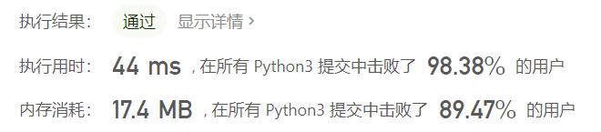

# 面试题10.02-变位词组

Author：_Mumu

创建日期：2021/7/18

通过日期：2021/7/18

*****

踩过的坑：

1. 我起了，一刀秒了...
2. 然后执行用时和内存占用都5%，好家伙，暴力计数不可取啊
3. 怎么排列再做哈希表就快这么多呢

已解决：45/2163

*****

难度：中等

问题描述：

编写一种方法，对字符串数组进行排序，将所有变位词组合在一起。变位词是指字母相同，但排列不同的字符串。

注意：本题相对原题稍作修改

示例:

输入: ["eat", "tea", "tan", "ate", "nat", "bat"],
输出:
[
  ["ate","eat","tea"],
  ["nat","tan"],
  ["bat"]
]
说明：

所有输入均为小写字母。
不考虑答案输出的顺序。

来源：力扣（LeetCode）
链接：https://leetcode-cn.com/problems/group-anagrams-lcci