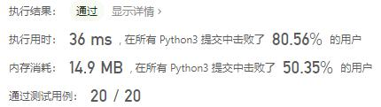
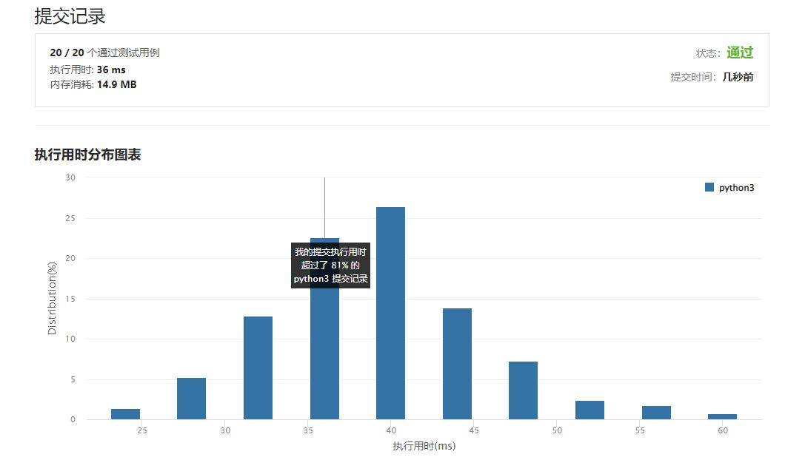

# 面试题17.09-第 k 个数

Author：_Mumu

创建日期：2022/09/28

通过日期：2022/09/28

*****

踩过的坑：

1. 轻松愉快（指直接cv

已解决：474/2792

*****

难度：中等

问题描述：

有些数的素因子只有 3，5，7，请设计一个算法找出第 k 个数。注意，不是必须有这些素因子，而是必须不包含其他的素因子。例如，前几个数按顺序应该是 1，3，5，7，9，15，21。

示例 1:

输入: k = 5

输出: 9

来源：力扣（LeetCode）
链接：https://leetcode.cn/problems/get-kth-magic-number-lcci