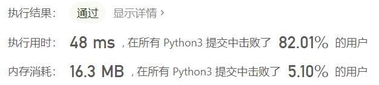
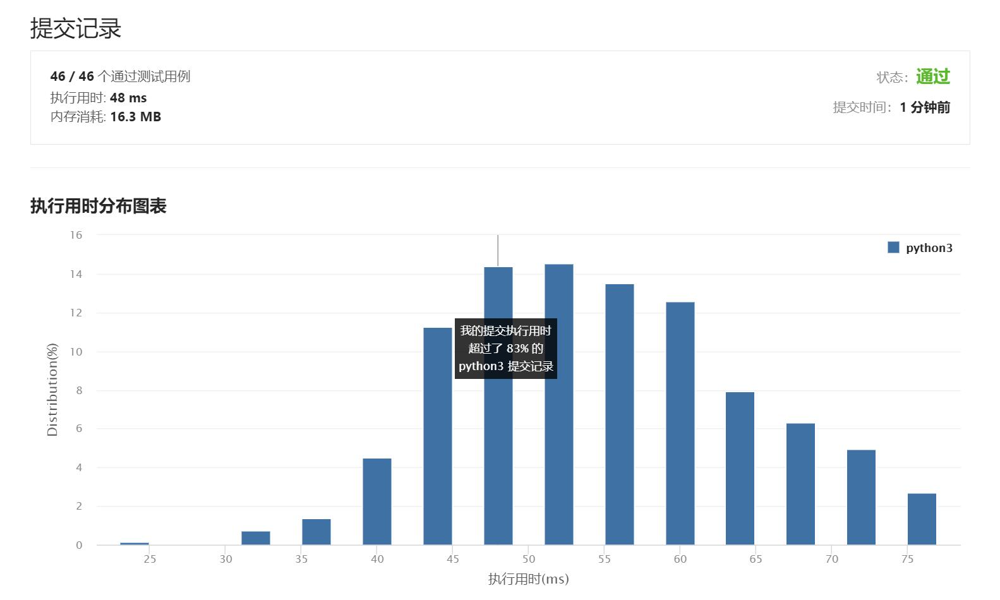

# 面试题17.10-主要元素

Author：_Mumu

创建日期：2021/7/9

通过日期：2021/7/9

*****

踩过的坑：

1. 我起了，看题解了，没什么好说的
2. 重新定义简单
3. 问题的难度在于同时规定了时间和空间复杂度，只有摩尔投票算法满足题目规定的复杂度要求
4. 先想象一个有多个势力的战场，战斗过程中不同势力的每两人同归于尽
5. 如果最后没有一个势力活下来，说明没有一个势力人数多余一半（人数多于一半的势力无论如何都会幸存到最后）
6. 但如果有势力活下来，也不一定是人数多于一半的势力，但如果这个势力不是人数最多的势力，那就一定没有势力人数多于一半（人数多于一半的势力无论如何都会幸存到最后）
7. 实操上不必检测它是否是人数最多，只需要检测它的人数是否多于一半即可，即便人数最多，只要不多于一半，那么它也不符题意
8. 按以上思路理解这个问题后，再看题解的摩尔投票算法就很好理解了，还会赞叹题解的算法实现起来的精妙之处

已解决：35/2153

*****

难度：简单

问题描述：

数组中占比超过一半的元素称之为主要元素。给你一个 整数 数组，找出其中的主要元素。若没有，返回 -1 。请设计时间复杂度为 O(N) 、空间复杂度为 O(1) 的解决方案。

 

示例 1：

输入：[1,2,5,9,5,9,5,5,5]
输出：5
示例 2：

输入：[3,2]
输出：-1
示例 3：

输入：[2,2,1,1,1,2,2]
输出：2

来源：力扣（LeetCode）
链接：https://leetcode-cn.com/problems/find-majority-element-lcci