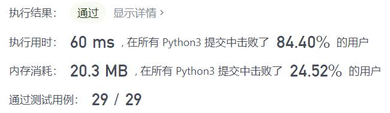
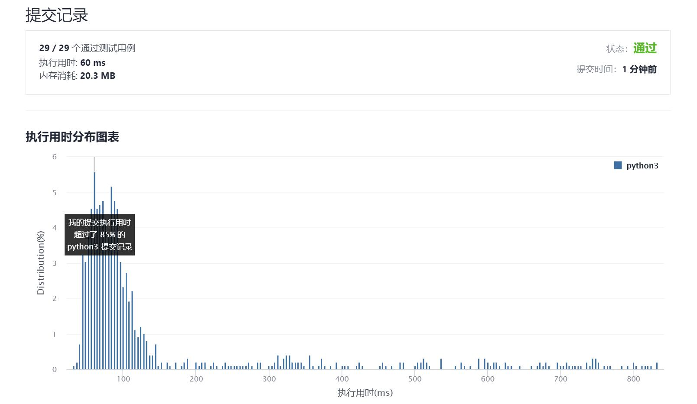

# 面试题17.14-最小K个数

Author：_Mumu

创建日期：2021/9/3

通过日期：2021/9/3

*****

踩过的坑：

1. 好耶
2. 第一反应当然是排序后取前k个，但是觉得肯定还能再优化
3. 就思考了一下，取多个最小数，应该是可以用堆来维护存储的，而每次维护堆用时大概是$O(\log k)$，而得到结论只需要遍历一次数组即可，所以算法时间复杂度是$O(n\log k)$，比排序是用时更短的
4. 细节上，由于Python的堆默认是小根堆，而维护最小的多个数需要的是大根堆，因此入堆时将数据取相反数，返回时再取相反数即可
5. 关于题解的快速选择，其实算法原理能够理解，但是不理解为什么时间复杂度能达到$O(n)$，不过也算是学习了类似快排算法的编写了

已解决：75/2333

*****

难度：中等

问题描述：

设计一个算法，找出数组中最小的k个数。以任意顺序返回这k个数均可。

示例：

输入： arr = [1,3,5,7,2,4,6,8], k = 4
输出： [1,2,3,4]
提示：

0 <= len(arr) <= 100000
0 <= k <= min(100000, len(arr))

来源：力扣（LeetCode）
链接：https://leetcode-cn.com/problems/smallest-k-lcci
