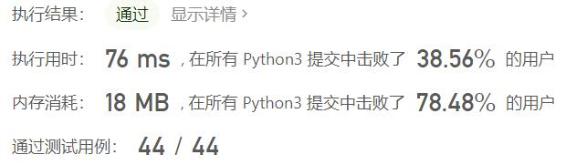
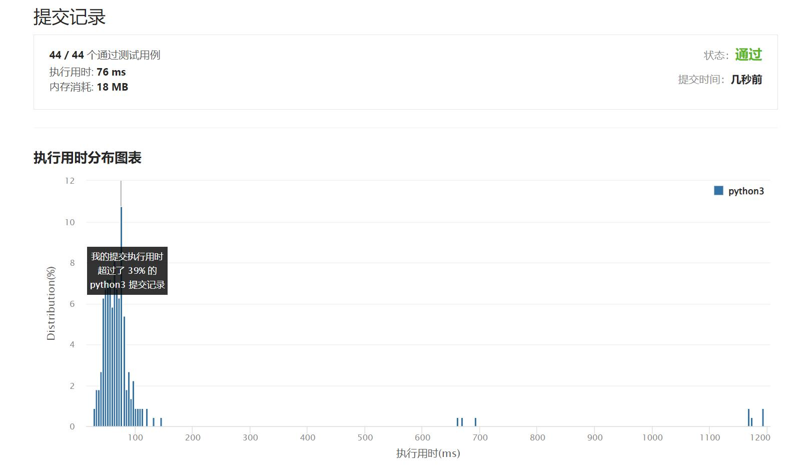

# 面试题17.19-消失的两个数字

Author：_Mumu

创建日期：2022/09/26

通过日期：2022/09/26

*****

踩过的坑：

1. 轻松愉快（指直接cv
1. 知道大概是用异或，但是没想到把数字分两组

已解决：473/2792

*****

难度：困难

问题描述：

给定一个数组，包含从 1 到 N 所有的整数，但其中缺了两个数字。你能在 O(N) 时间内只用 O(1) 的空间找到它们吗？

以任意顺序返回这两个数字均可。

示例 1:

输入: [1]
输出: [2,3]
示例 2:

输入: [2,3]
输出: [1,4]
提示：

nums.length <= 30000

来源：力扣（LeetCode）
链接：https://leetcode.cn/problems/missing-two-lcci